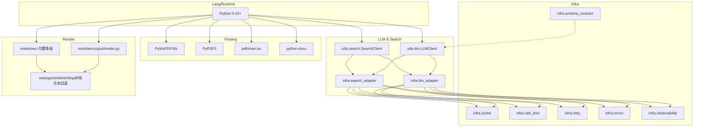
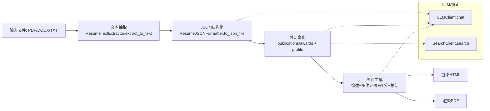

# 简历分析Agent架构文档

## 概述
- 目标：将候选人的简历文件（PDF/DOCX/TXT）解析为结构化JSON，进行外部资料富化与综合评价，并输出HTML/PDF报告。
- 当前形态：本地脚本化流水线，以Python实现文本抽取→JSON结构化→外网富化→终评→渲染，依赖.env配置的多家LLM与搜索服务。

## 技术栈
- 语言与运行时：Python 3.10+
- 文档解析：`PyMuPDF(fitz)`、`PyPDF2`、`pdfminer.six`、`python-docx`
- LLM接口：自研 `utils.llm.LLMClient`（OpenAI兼容 `/chat/completions`）
- Web搜索：自研 `utils.search.SearchClient`（Tavily、Bocha AI）
- 渲染：`markdown`（可选）、`weasyprint` 或 `wkhtmltopdf`（HTML→PDF，含纯Python回退）
- 并发：`concurrent.futures`（线程池）
- 配置与日志：`.env`；输出日志至 `output/logs/trace.jsonl`

## 现有架构

### 目录结构与主要组件
- 文本抽取：`modules/resume_text/extractor.py`（入口 `ResumeTextExtractor.extract_to_text` 在 65；PDF `_pdf_to_text` 在 9；DOCX `_docx_to_text` 在 47；清洗 `_sanitize_text` 在 110）
- JSON结构化：`modules/resume_json/formatter.py`（`ResumeJSONFormatter.to_json_file` 在 86；提示 `PROMPT_BASE` 在 12；拼接 `_prompt_with_schema` 在 39；稳健解析 `_ensure_json` 在 111）
- 外网富化与终评：`modules/resume_json/enricher.py`（并发富化与评估：`enrich_publications` 58-97；`enrich_awards` 99-131；`enrich_social_pulse` 299-331；`enrich_scholar_metrics` 455-475；`enrich_network_graph` 477-521；`academic_review` 543-563；`overall_summary` 564-606；`multi_dimension_evaluation` 608-664；`multi_dimension_scores` 666-689；终评聚合 `generate_final` 691-721）
- 输出渲染：`modules/output/render.py`（`render_html` 在 161；`render_pdf` 在 514；纯文本PDF `_simple_text_pdf` 在 535）
- 通用能力：
  - LLM客户端：`utils/llm.py:72` `LLMClient.chat`；环境加载 `from_env` 在 `utils/llm.py:290`
  - 搜索客户端：`utils/search.py:10` `SearchClient`；统一检索 `search` 在 `utils/search.py:157`
  - 文件工具：`tools/fs.py`（输出目录、读写、slug化）

### 数据流

### 关键路径与函数引用
- 文本抽取：`modules/resume_text/extractor.py:65`；PDF优先回退（`_pdf_to_text` 在 9；`_docx_to_text` 在 47）；清洗 `_sanitize_text` 在 110。
- 结构化：`modules/resume_json/formatter.py:86`；提示基准 `PROMPT_BASE` 在 12；`_prompt_with_schema` 在 39；稳健解析 `_ensure_json` 在 111（围栏块、贪婪括号、清洗、正则候选）。
- 富化与评估：`modules/resume_json/enricher.py` 论文 58-97、奖项 99-131、社交 299-331、学术指标 455-475、人脉 477-521、综述 543-563、综合 564-606、维度评价 608-664、评分 666-689。
- 终评：`modules/resume_json/enricher.py:691` `generate_final` 终评聚合与写出。
- 渲染：`modules/output/render.py:161` HTML卡片化布局；`render_pdf` 在 514（weasyprint→wkhtmltopdf→极简PDF）。
- LLM：`utils/llm.py:72` `chat`（重试、流式/非流式、日志追踪）；`from_env` 在 290（`LLM_DEFAULT_PROVIDER` 等）。
- 搜索：`utils/search.py:157` `search`（Tavily/Bocha归并与去重、日志追踪）。

### 观测、配置与错误处理
- 观测：各阶段向 `output/logs/trace.jsonl` 写入结构化记录（kind、耗时、字符数、模型/基址、搜索引擎等）。
- 配置：`.env` 提供 LLM 与搜索服务的 Key/地址；`LLM_DEFAULT_PROVIDER` 决定优先提供商。
- 错误处理：多层 `try/except` 容错与降级（解析/检索失败返回空，渲染失败回退极简PDF）；但错误分类与上报粒度有限。
