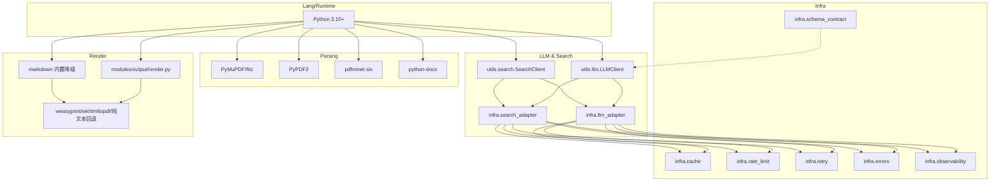
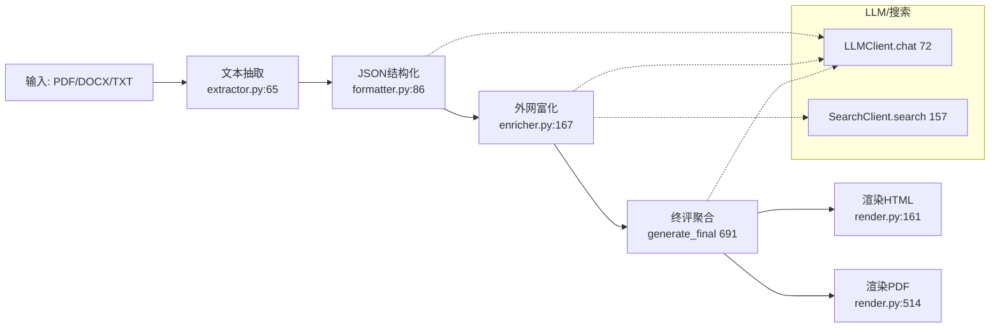

# 现有架构分析（简历分析Agent）

## 概述
- 目标：将候选人的简历文件（PDF/DOCX/TXT）解析为结构化JSON，进行外部资料富化与综合评价，并输出HTML/PDF报告。
- 当前形态：本地Python流水线，按“文本抽取 → JSON结构化 → 外网富化 → 终评 → 渲染输出”分层实现，依赖`.env`配置的LLM与搜索服务，输出统一写入`output/<slug>`。

## 技术栈组成图

## 目录与主要组件
- 文本抽取：`modules/resume_text/extractor.py`（入口 `ResumeTextExtractor.extract_to_text` 在 65；PDF优先 `_pdf_to_text` 在 9；DOCX `_docx_to_text` 在 47；清洗 `_sanitize_text` 在 110）
- JSON结构化：`modules/resume_json/formatter.py`（`ResumeJSONFormatter.to_json_file` 在 86；提示基准 `PROMPT_BASE` 在 12；拼接 `_prompt_with_schema` 在 39；稳健解析 `_ensure_json` 在 111）
- 外网富化与终评：`modules/resume_json/enricher.py`（并发富化与评估：`enrich_publications` 58-97；`enrich_awards` 99-131；`enrich_social_pulse` 299-331；`enrich_scholar_metrics` 455-475；`enrich_network_graph` 477-521；`academic_review` 543-563；`overall_summary` 564-606；`multi_dimension_evaluation` 608-664；`multi_dimension_scores` 666-689；终评聚合 `generate_final` 691-721）
- 输出渲染：`modules/output/render.py`（`render_html` 在 161；`render_pdf` 在 514；纯文本PDF `_simple_text_pdf` 在 535）
- 通用能力与适配：
  - LLM客户端：`utils/llm.py:72` `LLMClient.chat`；`from_env` 在 `utils/llm.py:290`
  - 搜索客户端：`utils/search.py:157` `SearchClient.search`；`from_env` 在 `utils/search.py:185`
  - 适配层：`infra/llm_adapter.py:15-77`；`infra/search_adapter.py:15-85`
  - 策略：缓存 `infra/cache.py:4-29`、限流 `infra/rate_limit.py:1-19`、重试 `infra/retry.py:7-23`、错误分级 `infra/errors.py:7-16`、观测 `infra/observability.py:1-14`
  - 契约：`infra/schema_contract.py:57-83`

## 调用关系与数据流

## 数据模型与存储
- 输入：`PDF/DOCX/TXT`
- 中间产物：`resume.txt`、`resume.json`、`resume_rich.json`、`resume_final.json`
- 输出：`resume_final.html`、`resume_final.pdf`
- Schema：`modules/resume_json/schema.json` 明确所有字段结构
- 日志：`output/logs/trace.jsonl`，各阶段写入结构化事件

## 错误处理、观测与性能
- 错误分级：`infra/errors.py` 提供基础错误模型；模块内部以 `try/except` 容错与回退。
- 速率与预算：适配层支持限流与重试；脚本层提供批量并发控制与离线模式。
- 缓存：请求级TTL缓存降低外部抖动。
- 观测：统一写入 `trace.jsonl`，包含耗时、字数、模型、引擎等。
- 性能热点：并发富化、LLM调用与渲染大文档为主要耗时点。

## 优缺点与技术债务
- 优点：
  - 端到端可运行、容错与回退充足；提示与渲染细节完整。
  - LLM/搜索抽象清晰，日志留痕便于排查。
- 不足与技术债务：
  - 依赖清单缺失（未见`requirements.txt`/`pyproject.toml`），环境复现风险。
  - `.env`明文Key管理薄弱，日志需脱敏。
  - 错误“吞吐”较多，缺少统一错误码、报警与质量监控。
  - 外呼缺少全局缓存/限流策略的强约束，批量并发可能触发平台限流。
  - PDF渲染受系统依赖影响，中文字体与跨平台质量不稳定。

## 关键函数索引（file_path:line）
- 文本抽取：`modules/resume_text/extractor.py:9,47,65,110`
- 结构化：`modules/resume_json/formatter.py:12,39,52,86,111`
- 富化与评估：`modules/resume_json/enricher.py:58,99,299,455,477,543,564,608,666,691`
- 渲染：`modules/output/render.py:161,514,535`
- LLM：`utils/llm.py:72,290`
- 搜索：`utils/search.py:157,185`
