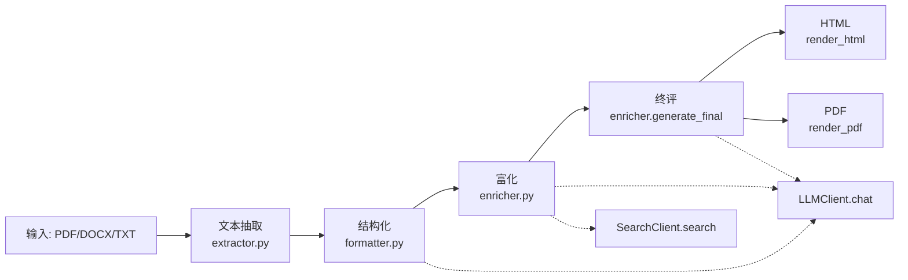

# 简历分析Agent重构计划

## 目标
- 将当前简历分析流水线升级为模块化、可扩展、强契约、可运维的新架构，降低外部依赖不稳定带来的风险，提升质量与性能。

## 现状分析
- 技术栈：Python 3.10+；PDF/DOCX解析（`PyMuPDF`/`PyPDF2`/`pdfminer.six`/`python-docx`）；LLM（`utils/llm.py` 多Provider）；搜索（`utils/search.py` Tavily/Bocha）；渲染（`markdown`、`weasyprint`/`wkhtmltopdf` 回退）。
- 核心模块与文件：
  - 文本抽取：`modules/resume_text/extractor.py:64`（PDF优先，`_pdf_to_text:9`，DOCX `47`，清洗 `110`）
  - JSON结构化：`modules/resume_json/formatter.py:80`（`PROMPT_BASE:11`，`_prompt_with_schema:38`，`_ensure_json:105`）
  - 富化/终评：`modules/resume_json/enricher.py:54,83,219,279,329,394,414`
  - 渲染：`modules/output/render.py:180,434,460`
  - LLM：`utils/llm.py:72,284`；搜索：`utils/search.py:157`
  - 文件工具：`tools/fs.py:23,31,35`
- 现有架构图：

- 与新架构不匹配项：
  - Provider适配与策略不足（缓存/限流/重试均分散或缺失）
  - 错误模型不统一（多处 `try/except` 吞错，缺少分级与告警）
  - 数据契约不强（LLM输出解析策略性为主，缺少 Schema 校验）
  - 证据链薄弱（来源保留不系统，打分/评价不可追溯）
  - 渲染跨平台质量不稳（字体/引擎差异未前置探测）
- 重构代码量与影响范围（估算）：
  - 新增基础设施模块（适配/策略/观测）：~600-800行
  - 结构化与校验改造：~200-300行
  - 富化与证据链扩展：~300-500行
  - 评估与评分解耦：~150-250行
  - 渲染改造（依赖探测、容错）：~120-180行
  - 测试与CI：~250-400行
  - 影响范围：`modules/*`、`utils/*`、`tools/*`、脚本入口，涉及全流程

## 重构规划
- 模块迁移优先级（低依赖→高依赖）：
  1) 基础设施层：`LLMAdapter`、`WebSearchAdapter`、`Cache`、`RateLimiter`、`RetryPolicy`、`ErrorModel`、`Observability`
  2) 契约层：`SchemaContract`（对 `modules/resume_json/schema.json` 执行校验）
  3) 结构化层：`Formatter` 对接新适配层与契约
  4) 富化层：`PublicationEnricher`、`AwardEnricher`、`ProfileAggregator`（统一证据字段）
  5) 评估层：`AcademicReview`、`MultiDimEval`、`ScoreExtractor`（强JSON契约）
  6) 渲染层：`HTMLRenderer`、`PDFRenderer`（依赖探测与回退优化）
  7) 入口与批处理：脚本封装批量运行与并发控制
- 每模块重构方案：
  - LLM/搜索适配层：统一接口 `chat`/`search`，内置缓存、限流、指数退避重试；错误分类（网络、配额、格式）与事件上报；保留旧 `utils.llm`/`utils.search` 作为兼容包装。
  - SchemaContract：引入严格校验（必填字段、类型、枚举），返回错误清单；结构化流程失败时走重试或灰度跳过。
  - Formatter：减少解析策略依赖，尽量使用 JSON 格式约束提示；对LLM返回进行 Schema 校验与失败回退（降级为空模版+记录）。
  - Enricher：并发控制统一在策略层；保存 `sources` 和 `evidence`（每条论文/奖项的来源URL与摘要片段）；摘要抓取格式化与清洗。
  - Evaluator：维度评价文本与评分分离；评分器统一从评价文本抽取分数，失败默认值可配置；所有输出均带来源引用。
  - Renderer：渲染前探测 `weasyprint`/`wkhtmltopdf` 与中文字体；失败时保留HTML并上报。
  - 入口：提供批处理模式、并发参数、预算与速率控制；保留旧命令兼容。
- 接口兼容层与过渡方案：
  - 在 `utils/llm.py` 与 `utils/search.py` 内添加到新适配层的桥接；逐步替换调用点。
  - 使用特性开关 `FEATURE_NEW_PIPELINE` 控制新旧路径，允许灰度与回滚。

## 实施步骤
- 步骤一：搭建基础设施框架
  - 新增 `infra/llm_adapter.py`、`infra/search_adapter.py`、`infra/cache.py`、`infra/rate_limit.py`、`infra/retry.py`、`infra/errors.py`、`infra/observability.py`
  - 在旧客户端中添加桥接调用（保持API不变）
  - 单元测试：适配层接口、缓存与限流策略、重试与错误分类
- 步骤二：引入 SchemaContract 并改造 Formatter
  - 在 `formatter.py` 写出后进行 Schema 校验，不合格记录 `trace` 并触发回退策略
  - 单元测试：合法/非法样例、解析策略退避
- 步骤三：富化层改造（证据链）
  - 统一保留 `sources`、`evidence`；搜索结果去重策略与摘要清洗函数
  - 单元测试：来源保留、摘要抓取、并发与限流配合
- 步骤四：评估层解耦与契约化
  - `MultiDimEval` 保证JSON输出；`ScoreExtractor` 从文本抽取分数并校验0-10
  - 单元测试：维度文本→分数解析边界与默认值
- 步骤五：渲染层稳健化
  - 引擎与字体探测；异常场景保留HTML并上报事件
  - 单元测试：不同平台引擎缺失回退
- 步骤六：入口与批处理
  - 批量任务入口、并发参数、预算控制与速率Guard；保留旧命令兼容
  - 集成测试：端到端流程在样例数据上运行

## 质量保障措施
- 自动化测试流水线：
  - 使用 `pytest`，覆盖率目标 ≥80%
  - 测试层级：单元（适配/策略/功能）、集成（阶段组合）、端到端（样例简历）
  - 外部接口使用Mock与回放（LLM/搜索），确保可重复
- 代码审查与架构检查点：
  - 每阶段提交前进行静态检查与架构Checklist（接口稳定性、错误模型、观测项）
  - 关键模块（适配层、Formatter、Enricher、Evaluator、Renderer）设评审门槛
- 回滚与应急：
  - `FEATURE_NEW_PIPELINE` 开关回退旧路径
  - 失败策略：保留中间产物与错误报告；在渲染失败时保留HTML
  - 紧急禁用外部富化与评估（仅结构化与HTML输出）

## 文档与交付
- 计划记录：本文件 `plan.md`（含阶段任务、关键节点、交付物、依赖关系与迁移顺序）
- 架构文档：`arch.md`（现状分析与新架构设计，含Mermaid图与接口）
- 测试报告：`output/linting/` 与 `output/logs/trace.jsonl` 作为观测与报告输出

## 时间估算与资源分配
- 时间估算（人日）：
  - 基础设施层：2.5
  - 契约层与Formatter：2.0
  - 富化层改造：2.0
  - 评估层：1.5
  - 渲染层：1.0
  - 测试与CI：2.0
  - 文档与验收：1.0
  - 合计：12.0 人日（可并行项略缩）
- 资源分配：
  - 架构负责人（1人）：适配层、契约、评估与总集成
  - 开发工程师（1人）：富化、渲染与入口、批处理
  - QA工程师（0.5人）：测试用例与回放、覆盖率与报告

## 风险控制
- 外部依赖不稳定：缓存/限流/重试 + 降级策略；Key与配额审计
- Schema收紧导致失败率增加：灰度启用与回退；失败原因统计优化提示工程
- 渲染跨平台差异：引擎与字体探测，失败保留HTML
- 开发复杂度提升：阶段化实施与强测试覆盖，架构检查点

## 里程碑与交付物
- M1（基础设施与契约，就绪）
  - 交付：适配/策略/观测模块；SchemaContract；桥接完成
- M2（结构化与富化，稳健）
  - 交付：Formatter契约化、证据链富化；单元与集成测试通过
- M3（评估与渲染，完善）
  - 交付：评价/评分解耦；渲染稳健化；端到端可运行
- M4（批处理与质量保障，收尾）
  - 交付：批处理入口、CI集成、覆盖率报告、回滚方案验证

## 新增功能模块实施计划（人脉图谱 / 全网声量侦测 / 学术指标）

### 阶段A：适配层与数据契约（1.5人日）
- 任务：
  - 定义 `SocialProviderAdapter` 接口（LinkedIn/知乎/Twitter/博客），实现搜索→公开页面抓取→轻量解析→标准化输出（账号/链接/粉丝/频率/话题/证据）
  - 定义 `ScholarMetricsFetcher` 接口，基于 Google Scholar 公开页面抓取并解析 `h_index`、`h10_index`、总引用、近五年引用；异常回退为空并记录原因
  - 补充 `SchemaContract` 扩展字段：`social_presence`、`social_influence`、`network_graph`、`basic_info.academic_metrics.h10_index`

### 阶段B：富化模块实现与集成（2.5人日）
- 任务：
  - 新增 `ResumeJSONEnricher.enrich_social_pulse(data)`：组合查询（姓名/机构/领域），调用 `SocialProviderAdapter`，生成平台集与指标摘要；保存 `sources/evidence`
  - 新增 `ResumeJSONEnricher.enrich_scholar_metrics(data)`：根据姓名/主页/Scholar链接抓取指标，更新 `basic_info.academic_metrics` 并扩展字段；保存 `sources`
  - 新增 `ResumeJSONEnricher.enrich_network_graph(data)`：利用 `education.supervisor`、`publications.authors` 和外部来源构建人脉节点与边（导师→学生、合作者→合著）；计算简化中心性（度/合著次数）；输出图概要与标签
  - 在 `enrich_file` 中并发触发上述三个富化方法，合并到 `resume_rich.json`

### 阶段C：评估与渲染扩展（1.5人日）
- 任务：
  - 在 `overall_summary` 中纳入社交与圈层信号；在 `multi_dimension_evaluation` 中融入行业影响力与协作依据中的社交证据
  - 页面渲染新增区块：
    - 人脉图谱概要卡片（导师、主要合作者、圈层标签、中心性指标）
    - 社交声量卡片（平台、粉丝、发文频率、技术话题要点）
    - 学术指标卡片（h-index、h10-index、总引用等）

### 阶段D：测试与质量保障（1.5人日）
- 任务：
  - 单元测试：`SocialProviderAdapter`、`ScholarMetricsFetcher` 的解析函数；`enricher` 三个新方法的聚合与证据链
  - 集成测试：离线Mock + 样例简历端到端；覆盖率 ≥80%
  - 预算与限流：环境变量 `BUDGET_MAX_*` 与 `*_RATE_*` 验证，异常回退与日志事件校验

### 风险与应对
- 平台限制与反爬：仅使用公开页面与检索结果；速率限制与缓存；失败回退空值并保留证据
- 姓名歧义：利用教育/机构/主页做消歧；LLM辅助规范化但不编造
- 指标准确性：以 Scholar 页面为准；若缺失则不输出；记录 `sources` 与时间戳

### 交付物
- 更新的 `arch.md`（架构图与接口）
- 扩展后的 `plan.md`（实施计划、风险与交付物）
- 代码实现与测试：`infra/social_adapter.py`、`modules/resume_json/enricher.py` 新增方法、渲染更新
